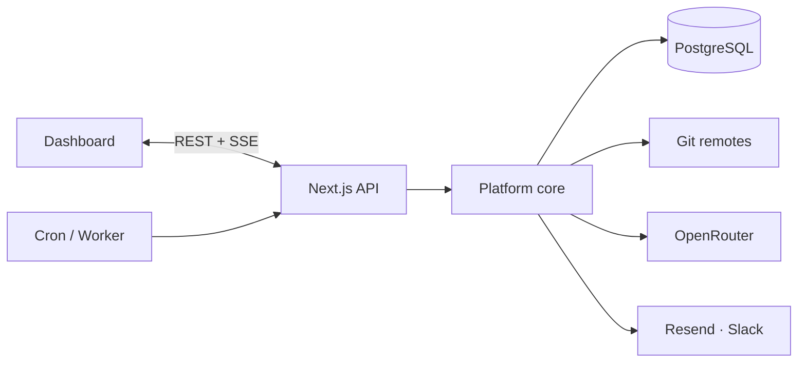

# ServiceLens

> The mesh, observed. Map Git-backed microservices, run continuous health probes, evaluate alert rules, manage incidents, and stream AI root-cause analysis with actionable fix-PR output.

**Live:** [servicelens.buildlab.in](https://servicelens.buildlab.in)

ServiceLens is a full-stack **AI SRE platform** for microservice architectures. It discovers service topology from Git repositories, monitors health with declarative probes and alert rules, opens lifecycle-managed incidents (manually, via rules, or through chaos drills), and uses an LLM to stream evidence-grounded root-cause analysis plus a structured fix-PR diff. Optional integrations cover OAuth sign-in, email and Slack notifications, and automated GitHub PR creation.

---

## Capabilities

### Service topology
Clone and analyze Git-backed repositories to infer frameworks, contracts, and dependency edges. The result is an interactive service graph with live health overlays — see upstream/downstream blast radius at a glance.

### Health monitoring and probes
HTTP and TCP probes run per service with aggregated status, response-time history, and sparkline trends. When endpoints are unreachable, a deterministic simulator keeps demo architectures observable.

### Declarative alert rules
A JSON DSL evaluates after every probe cycle: status checks, latency thresholds, error rates, consecutive failures, and regression failures. Rules support duration windows and auto-resolve when conditions clear.

### Incident management
Full lifecycle — open → acknowledged → resolved — with deduplication, assignment, comments, audit timeline, and log snapshots captured at incident open. Resolution notes become **runbook memory** for future incidents on the same service.

### AI root-cause analysis
On incident open, the platform assembles a rich context window (health history, 1-hop neighbor status, log lines, failed regression steps, prior resolutions) and streams an LLM-generated RCA over SSE. Output is structured markdown: likely root cause, cited evidence, and concrete next steps.

### Fix-PR generation
A second LLM pass produces structured patch output — branch name, per-file hunks, PR title and body. Render in the UI with copy/download, or open a draft PR via GitHub App integration.

### Chaos engineering
Schedule or manually trigger fault injection (`kill_service`, `degrade`, `latency_spike`) to validate the full detect → incident → notify → RCA path without waiting for production failures.

### Log aggregation
HEC-style ingest with per-service bearer tokens, searchable history, SSE live tail, and synthetic log generation correlated with service health.

### Notifications and realtime
In-app notification feed, Resend email, Slack webhooks with magic-link acknowledge, and a multiplexed SSE channel for live topology pulses, health updates, and bell notifications — no polling.

### Multi-user workspaces
Per-architecture membership with owner / editor / viewer roles. Every mutating action is recorded in an append-only audit log.

---

## How RCA works

Root-cause analysis is evidence-first, not a black-box chatbot.

1. **Trigger** — Opening an incident (alert rule, chaos drill, or manual) captures a log snapshot from the affected service and its 1-hop neighbors.
2. **Assemble** — When RCA runs, the pipeline gathers:
   - 30-minute health window on the affected service
   - Current status of topology neighbors (via `ServiceDependency` edges)
   - Warn/error log lines from the open-time snapshot
   - Recent failed regression steps on the architecture
   - Up to three prior resolved incidents on the same service, ranked by keyword overlap (runbook RAG-lite)
3. **Stream** — A structured prompt is sent to OpenRouter. Tokens stream to the incident detail page over SSE and persist incrementally to the database.
4. **Report** — The model produces markdown with three sections: **Likely root cause**, **Evidence** (citing specific timestamps and log lines), and **Suggested next steps**.
5. **Act** — **Generate fix PR** runs a follow-up LLM call that outputs a patch-ready JSON diff, optionally opened as a GitHub draft PR.

When the LLM is unavailable, a heuristic fallback still streams so the workflow remains demonstrable.

Full pipeline diagram and data flows: **[`docs/architecture.md`](./docs/architecture.md#ai-root-cause-analysis)**.

---

## Integrations

| Integration | Role in ServiceLens |
|---|---|
| **PostgreSQL** (Neon or local) | Primary datastore — architectures, services, health, incidents, audit |
| **OpenRouter** | Streamed RCA and fix-PR generation; rotating key pool with rate-limit fallback |
| **NextAuth** | Session auth — credentials plus optional GitHub / Google OAuth |
| **Resend** | Transactional email for incident notifications |
| **Slack** | Webhook posts with Block Kit formatting and one-click acknowledge links |
| **GitHub OAuth** | Sign-in provider |
| **GitHub App** | Optional — open draft PRs from the fix-PR flow |
| **Git remotes** | Shallow clone + analyze for topology discovery |
| **External cron / worker** | Drives chaos schedules and background job drain via `/api/cron/tick` |

Step-by-step credential setup: **[`docs/env_get.md`](./docs/env_get.md)**.

---

## Stack

| Layer | Technology |
|---|---|
| Framework | Next.js 14 (App Router), TypeScript, React 18 |
| UI | Tailwind CSS, shadcn/ui, React Flow, Recharts, Framer Motion |
| Backend | Next.js Route Handlers, SSE streams, Prisma ORM |
| Database | PostgreSQL |
| Auth | NextAuth (credentials + OAuth) |
| AI | OpenRouter (streaming chat completions) |
| Email | Resend + React Email templates |

---

## Getting started

```bash
git clone https://github.com/Abhishek-Mallick/ServiceLens.git
cd ServiceLens
npm install
cp .env.example .env
# fill DATABASE_URL, DIRECT_URL, NEXTAUTH_SECRET — see docs
npm run prisma:push && npm run prisma:seed
npm run dev
```

Sign in with `demo@servicelens.com` / `demo123`.

**Full local setup** — database options, every command, optional integrations, troubleshooting: **[`docs/LOCAL_SETUP.md`](./docs/LOCAL_SETUP.md)**.

**Production deploy** — Vercel, cron wiring, deployment caveats: **[`docs/deploy_vercel.md`](./docs/deploy_vercel.md)**.

---

## Architecture

ServiceLens follows a hub-and-spoke model: a thin API layer over a testable `lib/` core, with an in-process realtime bus fanning events to SSE clients and external services handling AI, notifications, and Git operations.



Detailed diagrams — observability loop, incident lifecycle, RCA pipeline, fix-PR flow, realtime bus, topology analysis: **[`docs/architecture.md`](./docs/architecture.md)**.

---

## Documentation

| Doc | Contents |
|---|---|
| [`docs/LOCAL_SETUP.md`](./docs/LOCAL_SETUP.md) | Local environment, database, commands, demo login |
| [`docs/architecture.md`](./docs/architecture.md) | System design, data flows, RCA pipeline, module reference |
| [`docs/env_get.md`](./docs/env_get.md) | Where every environment variable comes from |
| [`docs/deploy_vercel.md`](./docs/deploy_vercel.md) | Production deployment and cron setup |
