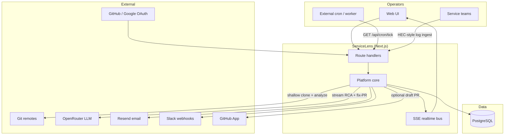
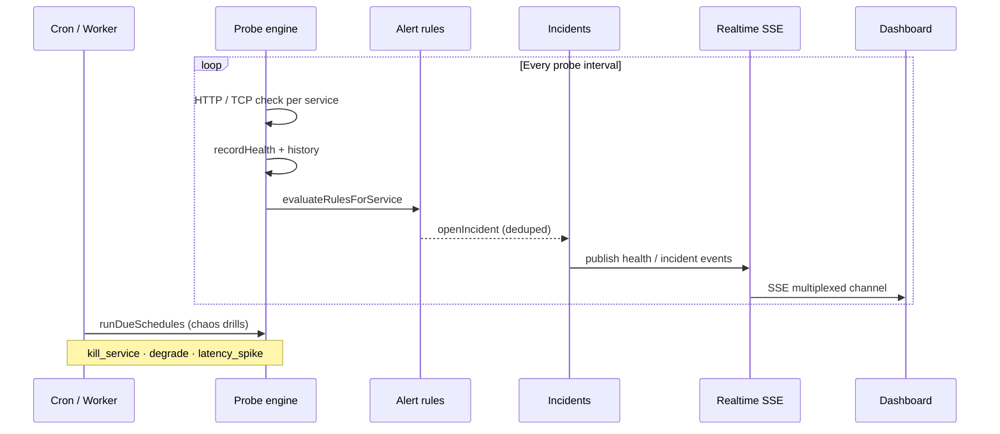
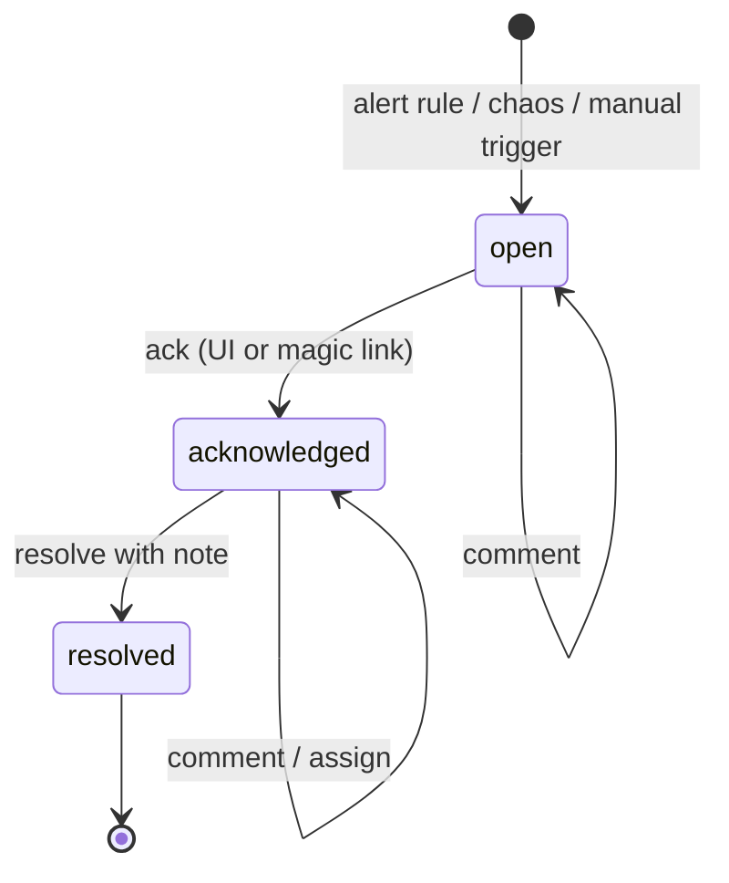
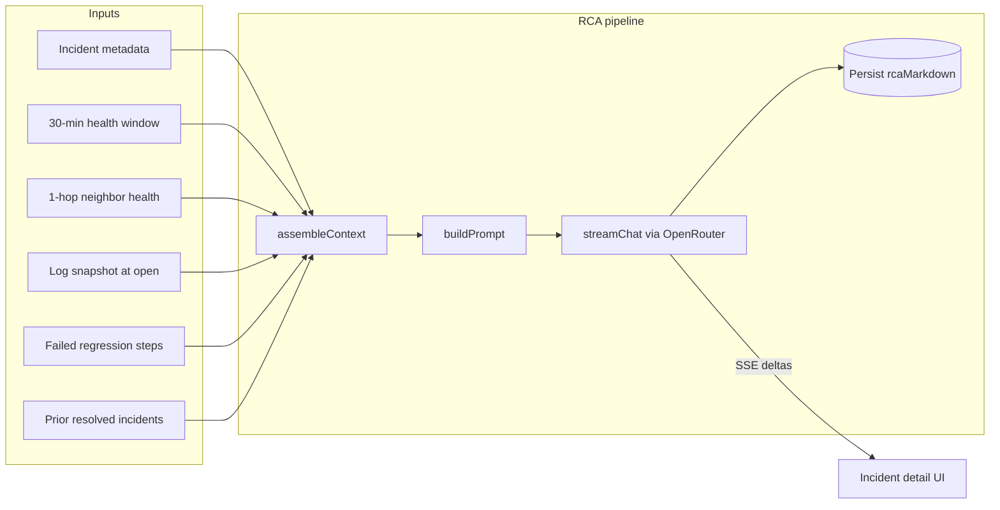
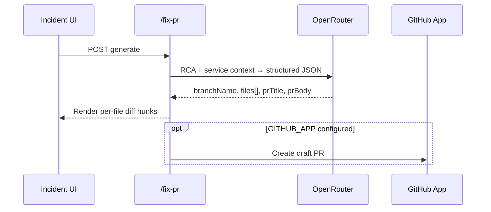
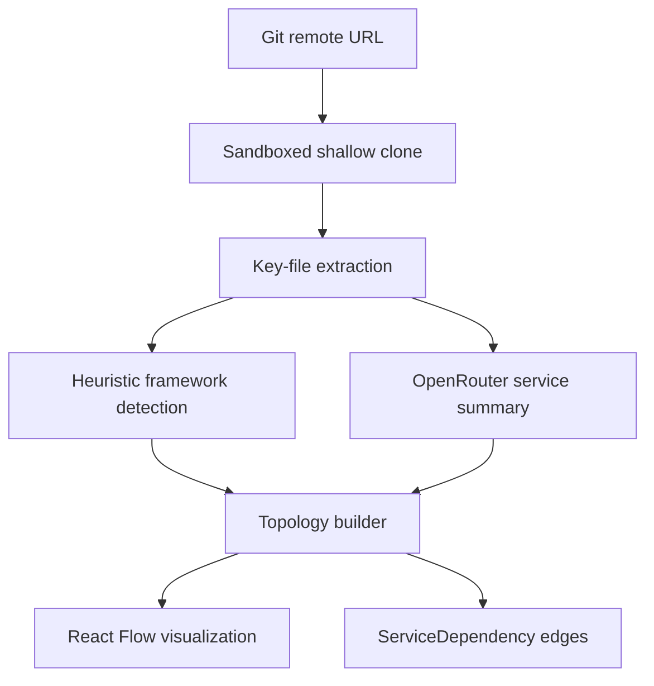

# Architecture

How ServiceLens observes a microservice mesh, reacts to failures, and drives AI-assisted incident response. For module-level ownership, see the [module reference](#module-reference) at the bottom.

---

## System context

ServiceLens sits between operators and their service landscape. It ingests Git repositories to infer topology, runs continuous health probes, evaluates declarative alert rules, manages incident lifecycles, and streams LLM-powered root-cause analysis back to the UI in real time.



---

## Observability loop

The platform continuously watches each architecture: probes write health records, alert rules fire incidents, and the realtime bus pushes state changes to every connected client without polling.



**Probe engine** — Each service can run multiple HTTP or TCP probes. Results aggregate into a health status and response-time history. When no endpoint is reachable, a deterministic simulator keeps the demo mesh alive.

**Alert rules** — A JSON DSL evaluates after every probe: `status_eq`, `p95_latency_gt`, `error_rate_gt`, `consecutive_down`, `regression_failed`. Rules support `forDuration` windows and auto-resolve when conditions clear.

**Chaos drills** — Scheduled or manual fault injection (`kill_service`, `degrade`, `latency_spike`) writes synthetic health degradation and can open critical incidents — useful for validating the full incident → RCA → notification path.

---

## Incident lifecycle

Incidents are first-class objects with a state machine, audit timeline, log snapshot at open time, and multi-channel notification dispatch.



When an incident opens:

1. **Dedup** — Same service + rule within a cooldown window merges into the existing open incident.
2. **Log snapshot** — Warn/error lines from the affected service and 1-hop neighbors are captured and stored on the timeline.
3. **Notifications** — In-app feed, email (Resend), and Slack (Block Kit + magic-link ack) fire through a provider abstraction.
4. **Realtime** — `incident_opened` events propagate over SSE so topology nodes pulse and the notification bell updates live.

Resolution notes are persisted and feed the **runbook memory** used in future RCA prompts on the same service.

---

## AI root-cause analysis

RCA is request-driven and streams token-by-token over SSE. The pipeline assembles evidence from multiple subsystems before calling the LLM.



### Context assembly

| Signal | Source | Purpose |
|---|---|---|
| Incident metadata | `Incident` row | Title, severity, service, rule summary |
| Health window | Last 30 min of `HealthRecord` on affected service | Status transitions, latency spikes |
| Neighbor health | `ServiceDependency` graph (1-hop) | Blast-radius — upstream/downstream degradation |
| Log snapshot | Captured at `openIncident` | Warn/error lines with timestamps |
| Failed regressions | Latest `RegressionRun` failed steps | Contract / flow breakage evidence |
| Runbook memory | Prior resolved incidents on same service | Keyword-overlap ranking of past resolutions |

### Prompt structure

The model receives a structured user message with labeled sections (health, neighbors, logs, regressions, prior resolutions) and is instructed to produce three markdown sections: **Likely root cause**, **Evidence** (citing specific timestamps), and **Suggested next steps**. Temperature is kept low (0.2) to reduce hallucination.

### Streaming and persistence

`POST /api/incidents/:id/rca` opens an SSE stream. Each token delta is forwarded to the client; the assembled markdown is incrementally persisted to `Incident.rcaMarkdown`. Timeline events `rca_started` and `rca_completed` are written for audit.

When OpenRouter is unavailable or rate-limited, a heuristic fallback still streams word-by-word so the incident workflow remains demonstrable.

---

## Fix-PR generation

A second LLM pass turns the RCA into actionable code changes.



Output schema: `{ branchName, files[{ path, content }], prTitle, prBody }`. The UI renders color-coded hunks with **Copy as patch** and **Download .patch**. With `GITHUB_APP_*` credentials, the platform can open a real draft PR on the linked repository.

---

## Topology and Git analysis



Clone operations are guarded: URL validation (SSRF protection), size cap (50 MB), and timeout (30 s). The topology builder derives dependency edges from import/call patterns and renders an interactive graph with live health overlays.

---

## Realtime architecture

```mermaid
flowchart LR
  Publishers[Probes · Incidents · Chaos · Health] --> Bus[In-process pub/sub]
  Bus --> SSE[/api/architectures/:id/events]
  SSE --> Clients[Browser tabs]
```

The realtime bus is an `EventEmitter` cached on `globalThis` so it survives Next.js HMR during development. Events are multiplexed on a single SSE connection per architecture: `health`, `incident_*`, `chaos`, `notification`.

**Deployment note:** On multi-instance serverless (e.g. Vercel), SSE fan-out is per-instance. Cross-tab live pulses require swapping the bus for Redis pub/sub — the `publish` / `subscribe` interface is designed for that swap.

---

## Authentication and multi-tenancy

- **NextAuth** — Credentials (seeded demo user), optional GitHub OAuth, optional Google OAuth.
- **Membership** — Per-architecture roles: `owner`, `editor`, `viewer`. Mutations are guarded and logged to an append-only audit trail.
- **Log ingest** — Per-service bearer tokens for HEC-style `POST /api/services/:id/logs`.

---

## Background processing

| Mechanism | Responsibility |
|---|---|
| `/api/cron/tick` | Drain due chaos schedules + job queue |
| `npm run worker` | Self-hosted equivalent on a configurable interval |
| `lib/jobs.ts` | In-process queue with retry/backoff (Redis/BullMQ swap-in ready) |

---

## Module reference

Platform logic lives in `lib/`; API routes are thin handlers. Key modules:

| Area | Modules |
|---|---|
| Observability | `probes.ts`, `health-monitor.ts`, `alert-rules.ts`, `logs.ts`, `log-generator.ts` |
| Incidents | `incidents.ts`, `rca.ts`, `fix-pr.ts`, `notify/` |
| Topology | `git-analyzer.ts`, `code-analyzer.ts`, `topology-builder.ts`, `openrouter.ts` |
| Chaos | `chaos.ts` |
| Platform | `realtime.ts`, `jobs.ts`, `membership.ts`, `audit.ts`, `auth.ts` |
| AI transport | `openrouter-stream.ts` |

Regression flow discovery runs through `regression-engine.ts` (simulated outcomes in the stock build).

---

## Related docs

- **[LOCAL_SETUP.md](./LOCAL_SETUP.md)** — clone, database, env, commands
- **[env_get.md](./env_get.md)** — where every env value comes from
- **[deploy_vercel.md](./deploy_vercel.md)** — production deploy, cron, caveats
