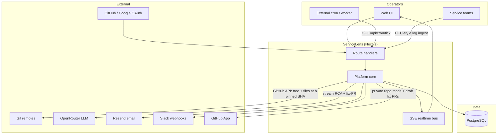
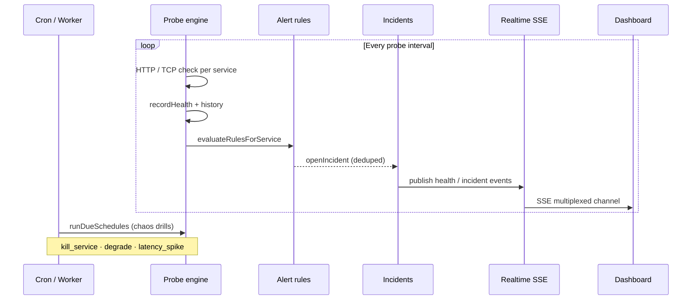
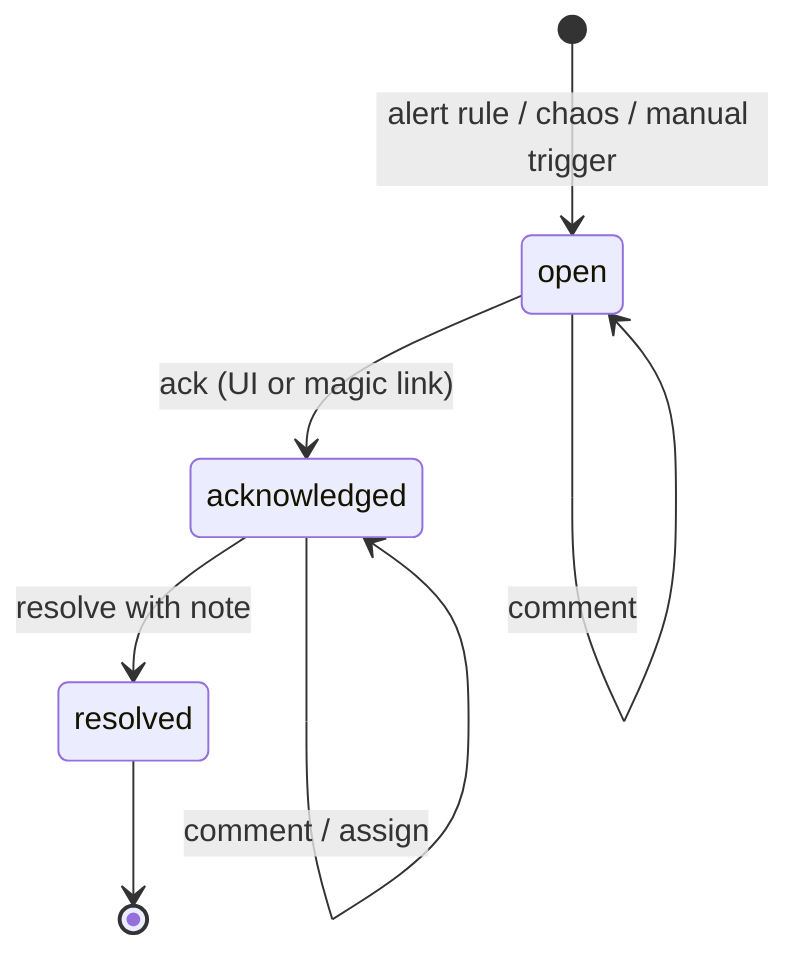
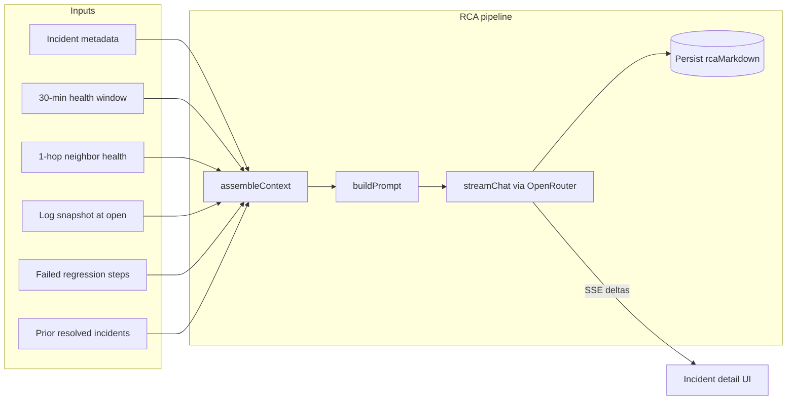
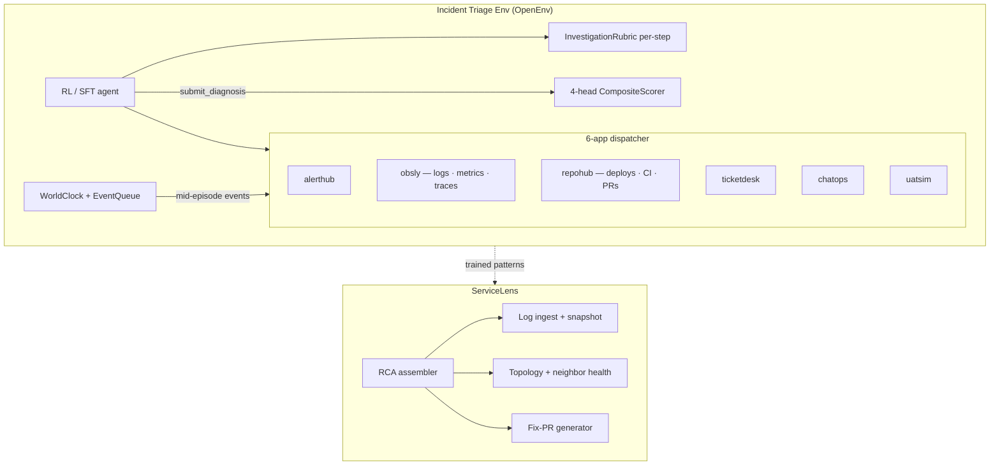
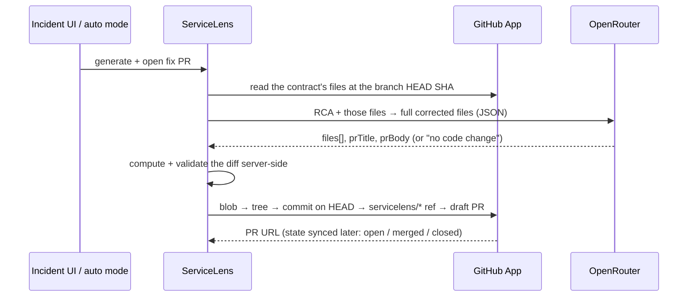
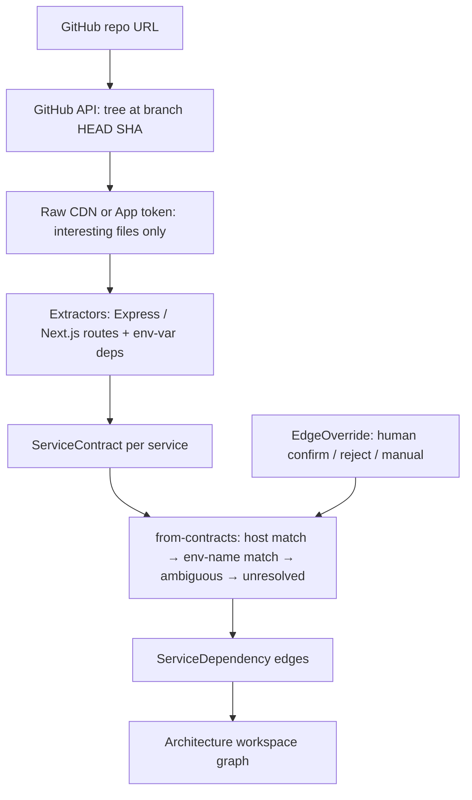

# Architecture

How ServiceLens observes a microservice mesh, reacts to failures, and drives AI-assisted incident response. For module-level ownership, see the [module reference](#module-reference) at the bottom.

---

## System context

ServiceLens sits between operators and their service landscape. It ingests Git repositories to infer topology, runs continuous health probes, evaluates declarative alert rules, manages incident lifecycles, and streams LLM-powered root-cause analysis back to the UI in real time.

```mermaid
flowchart TB
  subgraph Operators
    Browser[Web UI]
    ExtCron[External cron / worker]
    SvcTeams[Service teams]
  end

  subgraph ServiceLens["ServiceLens (Next.js)"]
    API[Route handlers]
    Core[Platform core]
    SSE[SSE realtime bus]
    Browser --> API
    API --> Core
    Core --> SSE
    SSE --> Browser
    ExtCron -->|GET /api/cron/tick| API
  end

  subgraph Data
    PG[(PostgreSQL)]
    Core --> PG
  end

  subgraph External
    Git[Git remotes]
    OR[OpenRouter LLM]
    Resend[Resend email]
    Slack[Slack webhooks]
    GHApp[GitHub App]
    OAuth[GitHub / Google OAuth]
  end

  Core -->|GitHub API: tree + files at a pinned SHA| Git
  Core -->|stream RCA + fix-PR| OR
  Core --> Resend
  Core --> Slack
  Core -->|private repo reads + draft fix PRs| GHApp
  OAuth --> API
  SvcTeams -->|HEC-style log ingest| API
```

---

## Observability loop

The platform continuously watches each architecture: probes write health records, alert rules fire incidents, and the realtime bus pushes state changes to every connected client without polling.

```mermaid
sequenceDiagram
  participant Cron as Cron / Worker
  participant Probes as Probe engine
  participant Rules as Alert rules
  participant Inc as Incidents
  participant RT as Realtime SSE
  participant UI as Dashboard

  loop Every probe interval
    Probes->>Probes: HTTP / TCP check per service
    Probes->>Probes: recordHealth + history
    Probes->>Rules: evaluateRulesForService
    Rules-->>Inc: openIncident (deduped)
    Inc->>RT: publish health / incident events
    RT->>UI: SSE multiplexed channel
  end

  Cron->>Probes: runDueSchedules (chaos drills)
  Note over Cron,Probes: kill_service · degrade · latency_spike
```

**Probe engine** — Each service can run multiple HTTP or TCP probes. Results aggregate into a health status and response-time history. When no endpoint is reachable, a deterministic simulator keeps the demo mesh alive.

**Alert rules** — A JSON DSL evaluates after every probe: `status_eq`, `p95_latency_gt`, `error_rate_gt`, `consecutive_down`, `regression_failed`. Rules support `forDuration` windows and auto-resolve when conditions clear.

**Chaos drills** — Scheduled or manual fault injection (`kill_service`, `degrade`, `latency_spike`) writes synthetic health degradation and can open critical incidents — useful for validating the full incident → RCA → notification path.

---

## Incident lifecycle

Incidents are first-class objects with a state machine, audit timeline, log snapshot at open time, and multi-channel notification dispatch.

```mermaid
stateDiagram-v2
  [*] --> open: alert rule / chaos / manual trigger
  open --> acknowledged: ack (UI or magic link)
  acknowledged --> resolved: resolve with note
  resolved --> [*]

  open --> open: comment
  acknowledged --> acknowledged: comment / assign
```

When an incident opens:

1. **Dedup** — Same service + rule within a cooldown window merges into the existing open incident.
2. **Log snapshot** — Warn/error lines from the affected service and 1-hop neighbors are captured and stored on the timeline.
3. **Notifications** — In-app feed, email (Resend), and Slack (Block Kit + magic-link ack) fire through a provider abstraction.
4. **Realtime** — `incident_opened` events propagate over SSE so topology nodes pulse and the notification bell updates live.

Resolution notes are persisted and feed the **runbook memory** used in future RCA prompts on the same service.

---

## AI root-cause analysis

RCA is request-driven and streams token-by-token over SSE. The pipeline assembles evidence from multiple subsystems before calling the LLM.

```mermaid
flowchart LR
  subgraph Inputs
    I[Incident metadata]
    H[30-min health window]
    N[1-hop neighbor health]
    L[Log snapshot at open]
    R[Failed regression steps]
    P[Prior resolved incidents]
  end

  subgraph RCA pipeline
    AC[assembleContext]
    BP[buildPrompt]
    ST[streamChat via OpenRouter]
    DB[(Persist rcaMarkdown)]
  end

  I & H & N & L & R & P --> AC
  AC --> BP
  BP --> ST
  ST -->|SSE deltas| UI[Incident detail UI]
  ST --> DB
```

### Context assembly

| Signal | Source | Purpose |
|---|---|---|
| Incident metadata | `Incident` row | Title, severity, service, rule summary |
| Health window | Last 30 min of `HealthRecord` on affected service | Status transitions, latency spikes |
| Neighbor health | `ServiceDependency` graph (1-hop) | Blast-radius — upstream/downstream degradation |
| Log snapshot | Captured at `openIncident` | Warn/error lines with timestamps |
| Failed regressions | Latest `RegressionRun` failed steps | Contract / flow breakage evidence |
| Runbook memory | Prior resolved incidents on same service | Keyword-overlap ranking of past resolutions |

### Prompt structure

The model receives a structured user message with labeled sections (health, neighbors, logs, regressions, prior resolutions) and is instructed to produce three markdown sections: **Likely root cause**, **Evidence** (citing specific timestamps), and **Suggested next steps**. Temperature is kept low (0.2) to reduce hallucination.

### Streaming and persistence

`POST /api/incidents/:id/rca` opens an SSE stream. Each token delta is forwarded to the client; the assembled markdown is incrementally persisted to `Incident.rcaMarkdown`. Timeline events `rca_started` and `rca_completed` are written for audit.

When OpenRouter is unavailable or rate-limited, a heuristic fallback still streams word-by-word so the incident workflow remains demonstrable.

### Training substrate — Incident Triage Environment

The RCA pipeline in ServiceLens is designed around investigative patterns validated in a companion [**OpenEnv-compliant RL environment**](https://huggingface.co/spaces/AbhishekMallick/incident-triage-env). The training env simulates the same observability signals ServiceLens surfaces in production:

```mermaid
flowchart TB
  subgraph Training["Incident Triage Env (OpenEnv)"]
    Agent[RL / SFT agent]
  subgraph Apps["6-app dispatcher"]
      AH[alerthub]
      OB[obsly — logs · metrics · traces]
      RH[repohub — deploys · CI · PRs]
      TD[ticketdesk]
      CO[chatops]
      UA[uatsim]
    end
    WC[WorldClock + EventQueue]
    Rubric[InvestigationRubric per-step]
    Grader[4-head CompositeScorer]
    Agent --> Apps
    WC -->|mid-episode events| Apps
    Agent --> Rubric
    Agent -->|submit_diagnosis| Grader
  end

  subgraph Production["ServiceLens"]
    RCA[RCA assembler]
    SL_Logs[Log ingest + snapshot]
    SL_Topo[Topology + neighbor health]
    SL_Fix[Fix-PR generator]
    RCA --> SL_Logs
    RCA --> SL_Topo
    RCA --> SL_Fix
  end

  Training -.->|trained patterns| Production
```

| Signal type | Training env action | ServiceLens equivalent |
|---|---|---|
| Logs | `obsly.query_logs` | HEC ingest + open-time log snapshot |
| Metrics | `obsly.query_metric` | Health probes + response-time history |
| Traces | `obsly.get_trace` | Regression flow steps + dependency edges |
| Topology | `obsly.trace_dependencies` | `ServiceDependency` graph + 1-hop RCA context |
| Deploys | `repohub.recent_commits` / `get_diff` | GitHub ingestion at a pinned commit (`lib/ingest/*`) |
| Remediation | `submit_diagnosis` + `pr_proposal` + `blast_radius` | RCA markdown + fix-PR JSON |
| Process hygiene | `PolicyEngine` per-step penalties | Runbook memory + alert-rule discipline |

Fine-tuned Qwen adapters ([HF Hub](https://huggingface.co/AbhishekMallick/incident-triage-grpo-train)) are trained on oracle trajectories with per-step rubric shaping and terminal 4-head grading (diagnosis · policy · blast-radius · PR-proposal). Held-out eval reaches **~76% composite score** (+102% over baseline), with the largest gains on structured blast-radius and PR outputs — the same structured fields ServiceLens emits in the fix-PR flow.

---

## Fix-PR generation

A second LLM pass turns the RCA into a code change, built from the service's real source (`lib/fix-pr.ts`, `lib/remediation.ts`).

```mermaid
sequenceDiagram
  participant Trigger as Incident UI / auto mode
  participant SL as ServiceLens
  participant GH as GitHub App
  participant LLM as OpenRouter

  Trigger->>SL: generate + open fix PR
  SL->>GH: read the contract's files at the branch HEAD SHA
  SL->>LLM: RCA + those files → full corrected files (JSON)
  LLM-->>SL: files[], prTitle, prBody (or "no code change")
  SL->>SL: compute + validate the diff server-side
  SL->>GH: blob → tree → commit on HEAD → servicelens/* ref → draft PR
  GH-->>SL: PR URL (state synced later: open / merged / closed)
```

Safety rails: draft only and never merged; only repos with the App installed; 1 PR per repo per hour; idempotent per incident; a blob-SHA conflict check means nothing is written if the file changed upstream; the demo never opens PRs; auto mode is off by default. Without a working LLM the request fails with a clear 503 — fixes are never faked.

---

## Topology and Git analysis

```mermaid
flowchart TB
  Repo[GitHub repo URL] --> Tree[GitHub API: tree at branch HEAD SHA]
  Tree --> Files[Raw CDN or App token: interesting files only]
  Files --> Extract[Extractors: Express / Next.js routes + env-var deps]
  Extract --> Contract[ServiceContract per service]
  Contract --> Derive[from-contracts: host match → env-name match → ambiguous → unresolved]
  Overrides[EdgeOverride: human confirm / reject / manual] --> Derive
  Derive --> Deps[ServiceDependency edges]
  Deps --> Workspace[Architecture workspace graph]
```

Ingestion costs 2 GitHub API calls per service (file bodies come from `raw.githubusercontent.com`, or the contents API with the App token for private repos) and falls back to the default branch. Edges are re-derived on analyze, rename, deployed-URL change and delete; human decisions survive re-analysis.

---

## Realtime architecture

```mermaid
flowchart LR
  Publishers[Probes · Incidents · Chaos · Health] --> Bus[In-process pub/sub]
  Bus --> SSE[/api/architectures/:id/events]
  SSE --> Clients[Browser tabs]
```

The realtime bus is an `EventEmitter` cached on `globalThis` so it survives Next.js HMR during development. Events are multiplexed on a single SSE connection per architecture: `health`, `incident_*`, `chaos`, `notification`.

**Deployment note:** On multi-instance serverless (e.g. Vercel), SSE fan-out is per-instance. Cross-tab live pulses require swapping the bus for Redis pub/sub — the `publish` / `subscribe` interface is designed for that swap.

---

## Authentication and multi-tenancy

- **NextAuth** — Credentials (seeded demo user), optional GitHub OAuth, optional Google OAuth.
- **Membership** — Per-architecture roles: `owner`, `editor`, `viewer`. Mutations are guarded and logged to an append-only audit trail.
- **Log ingest** — Per-service bearer tokens for HEC-style `POST /api/services/:id/logs`.

---

## Background processing

| Mechanism | Responsibility |
|---|---|
| `/api/cron/tick` | Drain due chaos schedules + job queue |
| `npm run worker` | Self-hosted equivalent on a configurable interval |
| `lib/jobs.ts` | In-process queue with retry/backoff (Redis/BullMQ swap-in ready) |

---

## Module reference

Platform logic lives in `lib/`; API routes are thin handlers. Key modules:

| Area | Modules |
|---|---|
| Observability | `probes.ts`, `health-monitor.ts`, `alert-rules.ts`, `logs.ts`, `log-generator.ts` |
| Incidents | `incidents.ts`, `rca.ts`, `fix-pr.ts`, `notify/` |
| Topology | `ingest/*`, `analyze.ts`, `topology/from-contracts.ts`, `topology/insights.ts`, `topology-builder.ts` (demo layout) |
| Monitoring | `scheduler.ts`, `datastore-probes.ts`, `net-guard.ts`, `monitoring/defaults.ts` |
| Incidents | `incident-pipeline.ts`, `oncall/*`, `remediation.ts`, `runbook.ts` |
| Chaos | `chaos.ts` (demo only) |
| Platform | `realtime.ts`, `jobs.ts`, `job-handlers.ts`, `membership.ts`, `access.ts`, `audit.ts`, `auth.ts`, `secrets.ts`, `rate-limit.ts`, `api-keys.ts` |
| Workspace & UI | `workspace.ts`, `design-tokens.ts` |
| AI transport | `openrouter-stream.ts`, `github/app.ts` |

Real architectures run contract tests (`contract-tests.ts`); the demo keeps the simulated `regression-engine.ts`.

---

## Related docs

- **[LOCAL_SETUP.md](./LOCAL_SETUP.md)** — clone, database, env, commands
- **[env_get.md](./env_get.md)** — where every env value comes from
- **[deploy_vercel.md](./deploy_vercel.md)** — production deploy, cron, caveats
- **[Incident Triage Env](https://github.com/deepraj21/Incident-Triage-Env/tree/feat/incident-triage-env)** — OpenEnv RL training environment ([HF Space](https://huggingface.co/spaces/AbhishekMallick/incident-triage-env))
